# SC-701: Proyecto Final - Grupo #6.
# **ASECCC Digital**

## 👥 Integrantes del Grupo

| **Nombre Completo** | 
|-------------------|
| Geovanny Arias Suárez | 
| Gabriel Centeno Vargas | 
| Daniel Mora Solano | 
| Carlos Bello Salinas | 

## 🛢 Diagrama de Base de Datos

El siguiente diagrama muestra la estructura completa de nuestra base de datos, incluyendo todas las tablas, sus columnas, tipos de datos, llaves primarias y foráneas, así como las relaciones entre entidades:

```mermaid
erDiagram
    Usuario {
        INT usuarioId PK "IDENTITY(1,1)"
        VARCHAR(255) nombreCompleto "NOT NULL"
        VARCHAR(255) correoElectronico "NOT NULL"
        VARCHAR(255) contrasena "NOT NULL"
        VARCHAR(10) tipoIdentificacion "NOT NULL"
        VARCHAR(12) identificacion "NOT NULL"
        DATETIME fechaNacimiento "NOT NULL"
        VARCHAR(20) telefono "NOT NULL"
        VARCHAR(255) direccion "NOT NULL"
        VARCHAR(50) rol "NOT NULL"
        VARCHAR(50) estadoAfiliacion "NOT NULL"
        DATETIME fechaIngreso
        INT perfilId FK "NOT NULL"
        BIT estado "NOT NULL DEFAULT 1"
    }

    Perfil {
        INT perfilId PK "IDENTITY(1,1)"
        VARCHAR(100) Nombre "NOT NULL"
    }

    CatalogoTipoAhorro {
        INT tipoAhorroId PK "IDENTITY(1,1)"
        VARCHAR(50) tipoAhorro "NOT NULL"
    }

    CatalogoTipoTransaccion {
        INT tipoTransaccionId PK "IDENTITY(1,1)"
        VARCHAR(50) tipoTransaccion "NOT NULL"
    }

    Ahorros {
        INT ahorroId PK "IDENTITY(1,1)"
        INT usuarioId FK "NOT NULL"
        INT tipoAhorroId FK "NOT NULL"
        DECIMAL montoInicial "NOT NULL"
        DECIMAL montoActual "NOT NULL"
        DATETIME fechaInicio
        INT plazo
        VARCHAR(50) estado "NOT NULL"
    }

    AhorroTransacciones {
        INT transaccionAhorroId PK "IDENTITY(1,1)"
        INT ahorroId FK "NOT NULL"
        INT tipoTransaccionId FK "NOT NULL"
        DECIMAL monto "NOT NULL"
        DATETIME fechaTransaccion
        VARCHAR descripcion
    }

    Aportes {
        INT aporteId PK "IDENTITY(1,1)"
        INT usuarioId FK
        VARCHAR(50) tipoAporte "NOT NULL"
        DECIMAL monto "NOT NULL"
        DATETIME fechaRegistro
    }

    AportesTransacciones {
        INT transaccionAportesId PK "IDENTITY(1,1)"
        INT aporteId FK "NOT NULL"
        DECIMAL monto "NOT NULL"
        DATETIME fechaTransaccion
        VARCHAR descripcion
    }

    Beneficiarios {
        INT beneficiarioId PK "IDENTITY(1,1)"
        INT usuarioId FK
        VARCHAR(255) nombreCompleto "NOT NULL"
        VARCHAR(100) relacion "NOT NULL"
        DECIMAL porcentajeBeneficio "NOT NULL"
    }

    BeneficiosServicios {
        INT beneficioId PK "IDENTITY(1,1)"
        VARCHAR(255) nombre "NOT NULL"
        VARCHAR descripcion
        VARCHAR(100) categoria
        VARCHAR requisitos
        VARCHAR(50) estado "NOT NULL"
        DATETIME fechaRegistro
    }

    BeneficiosServiciosCuenta {
        INT cuentaBeneficiosServiciosId PK "IDENTITY(1,1)"
        INT usuarioId FK "NOT NULL"
        INT beneficioId FK "NOT NULL"
        DECIMAL montoTotal "NOT NULL"
        DECIMAL montoPendiente "NOT NULL"
        VARCHAR(50) numeroProforma
        INT plazo
        DATETIME fechaCreacion
        VARCHAR(50) estado "NOT NULL"
    }

    BeneficiosTransacciones {
        INT transaccionId PK "IDENTITY(1,1)"
        INT cuentaBeneficiosServiciosId FK "NOT NULL"
        DECIMAL monto "NOT NULL"
        DATETIME fechaTransaccion
        VARCHAR descripcion
    }

    Prestamos {
        INT prestamoId PK "IDENTITY(1,1)"
        INT usuarioId FK
        DECIMAL montoAprobado
        INT plazo "NOT NULL"
        DECIMAL cuotaSemanal
        VARCHAR(50) tipoPrestamo "NOT NULL"
        VARCHAR(50) estadoPrestamo "NOT NULL"
        DATETIME fechaSolicitud
        DATETIME fechaEstado
        DECIMAL saldoPendiente
        VARCHAR observaciones
    }

    PrestamosTransacciones {
        INT transaccionPrestamoId PK "IDENTITY(1,1)"
        INT prestamoId FK
        DECIMAL montoAbonado "NOT NULL"
        DATETIME fechaPago
    }

    SolicitudesPrestamo {
        INT solicitudPrestamoId PK "IDENTITY(1,1)"
        INT usuarioId FK "NOT NULL"
        NVARCHAR estadoCivil "NOT NULL"
        BIT pagaAlquiler "NOT NULL"
        DECIMAL montoAlquiler
        NVARCHAR nombreAcreedor
        DECIMAL totalCredito
        DECIMAL abonoSemanal
        DECIMAL saldoCredito
        NVARCHAR nombreDeudor
        DECIMAL totalPrestamo
        DECIMAL saldoPrestamo
        NVARCHAR tipoPrestamo "NOT NULL"
        DECIMAL montoSolicitud "NOT NULL"
        NVARCHAR estadoSolicitud "NOT NULL"
        DECIMAL cuotaSemanalSolicitud "NOT NULL"
        INT plazoMeses "NOT NULL"
        NVARCHAR propositoPrestamo "NOT NULL"
        DATETIME fechaSolicitud
    }

    Notificaciones {
        INT notificacionId PK "IDENTITY(1,1)"
        INT usuarioId FK
        VARCHAR(255) titulo "NOT NULL"
        VARCHAR contenido "NOT NULL"
        VARCHAR(50) tipo "NOT NULL"
        DATETIME fechaEnvio
        VARCHAR(50) estado "NOT NULL"
    }

    SeguridadAuditoria {
        INT auditoriaId PK "IDENTITY(1,1)"
        INT usuarioId FK
        VARCHAR(255) accion "NOT NULL"
        DATETIME fechaAccion
        VARCHAR(50) direccionIp
        VARCHAR(50) tipoAccion
    }

    Error {
        INT errorId PK "IDENTITY(1,1)"
        INT usuarioId FK "NOT NULL"
        VARCHAR mensaje "NOT NULL"
        VARCHAR(50) origen "NOT NULL"
        DATETIME fechaHora "NOT NULL"
    }

    Perfil ||--o{ Usuario : "perfilId"
    Usuario ||--o{ Ahorros : "usuarioId"
    Usuario ||--o{ Aportes : "usuarioId"
    Usuario ||--o{ Beneficiarios : "usuarioId"
    Usuario ||--o{ BeneficiosServiciosCuenta : "usuarioId"
    Usuario ||--o{ Prestamos : "usuarioId"
    Usuario ||--o{ SolicitudesPrestamo : "usuarioId"
    Usuario ||--o{ Notificaciones : "usuarioId"
    Usuario ||--o{ SeguridadAuditoria : "usuarioId"
    Usuario ||--o{ Error : "usuarioId"
    CatalogoTipoAhorro ||--o{ Ahorros : "tipoAhorroId"
    CatalogoTipoTransaccion ||--o{ AhorroTransacciones : "tipoTransaccionId"
    Ahorros ||--o{ AhorroTransacciones : "ahorroId"
    Aportes ||--o{ AportesTransacciones : "aporteId"
    BeneficiosServicios ||--o{ BeneficiosServiciosCuenta : "beneficioId"
    BeneficiosServiciosCuenta ||--o{ BeneficiosTransacciones : "cuentaBeneficiosServiciosId"
    Prestamos ||--o{ PrestamosTransacciones : "prestamoId"
```

> **Link al recurso:** [Diagrama Entidad-Relación ASECCC Digital](https://www.mermaidchart.com/d/9c36ec1e-d81d-4c9e-b94d-dd8d0192fe4a)

### 📋 Descripción de las Entidades

**Tabla Usuario:**
- Almacena la información completa de los asociados de la cooperativa
- Gestión de credenciales y datos de contacto
- Control de roles y estados de afiliación
- Relación con perfil para permisos específicos

**Tabla Perfil:**
- Define los diferentes perfiles de acceso al sistema
- Permite la gestión de permisos por tipo de usuario
- Base para el control de autorización

**Tabla CatalogoTipoAhorro:**
- Catálogo de tipos de ahorro disponibles
- Facilita la clasificación de productos financieros
- Permite la expansión de opciones de ahorro

**Tabla CatalogoTipoTransaccion:**
- Registro de tipos de transacciones permitidas
- Estandarización de operaciones financieras
- Control de movimientos por categoría

**Tabla Ahorros:**
- Gestión de cuentas de ahorro de los asociados
- Seguimiento de montos y plazos
- Control de estados de cuentas activas

**Tabla AhorroTransacciones:**
- Historial completo de movimientos en ahorros
- Registro detallado de depósitos y retiros
- Trazabilidad de operaciones financieras

**Tabla Aportes:**
- Registro de aportes realizados por los asociados
- Control de contribuciones al capital social
- Seguimiento de compromisos financieros

**Tabla AportesTransacciones:**
- Historial de transacciones relacionadas con aportes
- Detalle de movimientos de capital
- Auditoría de contribuciones

**Tabla Beneficiarios:**
- Registro de personas beneficiarias de los asociados
- Gestión de porcentajes de beneficio
- Control de relaciones familiares o designadas

**Tabla BeneficiosServicios:**
- Catálogo de servicios y beneficios disponibles
- Descripción detallada de requisitos y condiciones
- Gestión de categorías de beneficios

**Tabla BeneficiosServiciosCuenta:**
- Vinculación de usuarios con servicios adquiridos
- Control de montos y pagos pendientes
- Seguimiento de plazos y estados de cuentas

**Tabla BeneficiosTransacciones:**
- Historial de pagos de beneficios y servicios
- Registro de abonos y liquidaciones
- Trazabilidad de operaciones

**Tabla Prestamos:**
- Gestión integral de préstamos aprobados
- Control de montos, plazos y cuotas
- Seguimiento de estados y saldos pendientes

**Tabla PrestamosTransacciones:**
- Registro de pagos realizados a préstamos
- Historial de abonos y amortizaciones
- Control de cumplimiento de obligaciones

**Tabla SolicitudesPrestamo:**
- Captura de información para solicitudes de préstamos
- Evaluación de capacidad de pago
- Gestión del proceso de aprobación

**Tabla Notificaciones:**
- Sistema de comunicación con los asociados
- Envío de recordatorios y avisos importantes
- Control de estados de notificaciones

**Tabla SeguridadAuditoria:**
- Registro de acciones realizadas en el sistema
- Trazabilidad de operaciones por usuario
- Control de seguridad y cumplimiento

**Tabla Error:**
- Registro de errores del sistema
- Seguimiento de incidencias por usuario
- Soporte para diagnóstico y resolución

---

## 🎯 Objetivos del Proyecto

### OBJETIVO GENERAL

Desarrollar una aplicación web para la asociación "ASECCC" utilizando ASP.NET Core (tanto Web App como Web API), que permita una gestión eficiente de los socios, préstamos y transacciones financieras, posibilitando así, una plataforma moderna, segura y accesible a nivel usuario (asociado) como administrador.

### OBJETIVOS ESPECÍFICOS

- Implementar una interfaz web dinámica y responsive, mediante ASP.NET Core Web App, que facilite el registro consulta y actualización de información pertinente a la asociación (ahorros, beneficiarios, transacciones, préstamos).

- Diseñar y exponer una API RESTful desarrollada con ASP.NET Core Web API, que proporcione servicios centralizados y seguros para el intercambio de datos entre los distintos módulos del sistema y posibles aplicaciones móviles futuras.

- Integrar mecanismos de autenticación, autorización y auditoría que garanticen la protección de la información financiera y personal de los socios, aplicando buenas prácticas de seguridad y cumplimiento normativo en entornos web.

---

## 📌 Importancia del Proyecto

Este proyecto se fundamenta en un contexto ficticio. La idea de desarrollar una aplicación Web ha tomado relevancia ya que esta asociación realmente no posee una solución integral óptima para poder gestionar los recursos que ofrecen, por este motivo es que este proyecto toma una importancia evidente, ya que, optando por esta solución, se podrán ver avances evidentes a corto y largo plazo para esta entidad.

---

## 📋 Requerimientos Funcionales

Los requerimientos funcionales se describen como una declaración de alguna función o característica que se debe implementar en un sistema. El sistema debe diseñarse para cumplir las expectativas de tanto el administrador como el usuario, en este caso el asociado. Dado esto se establecen los siguientes módulos que se detallan a continuación:

### 1. Gestión de Seguridad y Permisos
Este módulo se encarga de administrar y asegurar el control de accesos mediante la implementación de niveles de autorización diferenciados para los asociados y administradores del sistema. Permite establecer permisos específicos según el rol del usuario, garantizando que únicamente las personas autorizadas puedan acceder a información sensible y funcionalidades críticas del sistema.

### 2. Gestión de Reportes
Este módulo proporciona las herramientas necesarias para la generación de informes detallados que incluyen datos financieros y estadísticos de la asociación. Permite producir reportes estructurados que facilitan el análisis de la información y la toma de decisiones por parte de los administradores.

### 3. Gestión de Beneficios y Servicios
Este módulo permite a los asociados consultar de manera clara y organizada el catálogo completo de beneficios y servicios a los que tienen derecho como miembros de la asociación. Facilita el acceso a información detallada sobre cada beneficio disponible.

### 4. Gestión de Ahorros y Aportes
Este módulo se encarga del registro sistemático y el monitoreo continuo de los ahorros y aportes realizados por los asociados, proporcionando un control detallado de las transacciones financieras. Permite realizar operaciones de actualización de montos, eliminación de registros incorrectos y cancelación de ahorros o aportes cuando sea necesario.

### 5. Gestión de Préstamos
Este módulo permite el manejo integral de las solicitudes de préstamos de los asociados, desde su registro inicial hasta su aprobación final. Facilita la evaluación de cada solicitud pendiente, permitiendo a los administradores revisar la información presentada y dar seguimiento detallado.

### 6. Gestión de Notificaciones
Este módulo permite mantener informados a los miembros de la asociación mediante el envío de recordatorios y avisos importantes. Facilita la comunicación efectiva entre la administración y los asociados.

### 7. Gestión de Asociados
Este módulo tiene como objetivo principal administrar toda la información relacionada con los miembros de la asociación de manera centralizada. Permite el registro completo de nuevos asociados capturando todos sus datos personales y de contacto.

### 8. Perfil de Asociado
Este módulo permite a cada asociado acceder a su información personal almacenada en el sistema y realizar actualizaciones cuando sea necesario. Los usuarios pueden visualizar sus datos actuales y modificarlos para corregir errores o reflejar cambios en su situación personal.

### 9. FAQ
Este módulo proporciona acceso a una lista estructurada de preguntas frecuentes acompañadas de sus respuestas correspondientes. Su propósito es ofrecer a los asociados una herramienta de auto-consulta que les permita resolver dudas comunes de manera rápida y eficiente.

---

## 🎮 Información del Proyecto

**Proyecto:** Aplicación Web/API ASP.NET Core para Asociación Financiera "ASECCC".

**Curso:** SC-701: Programación Avanzada en Web.

**Cuatrimestre:** III Cuatrimestre 2025.

**Fecha de entrega:** 18 de diciembre de 2025.

---

**© 2025 - Universidad Fidélitas**
